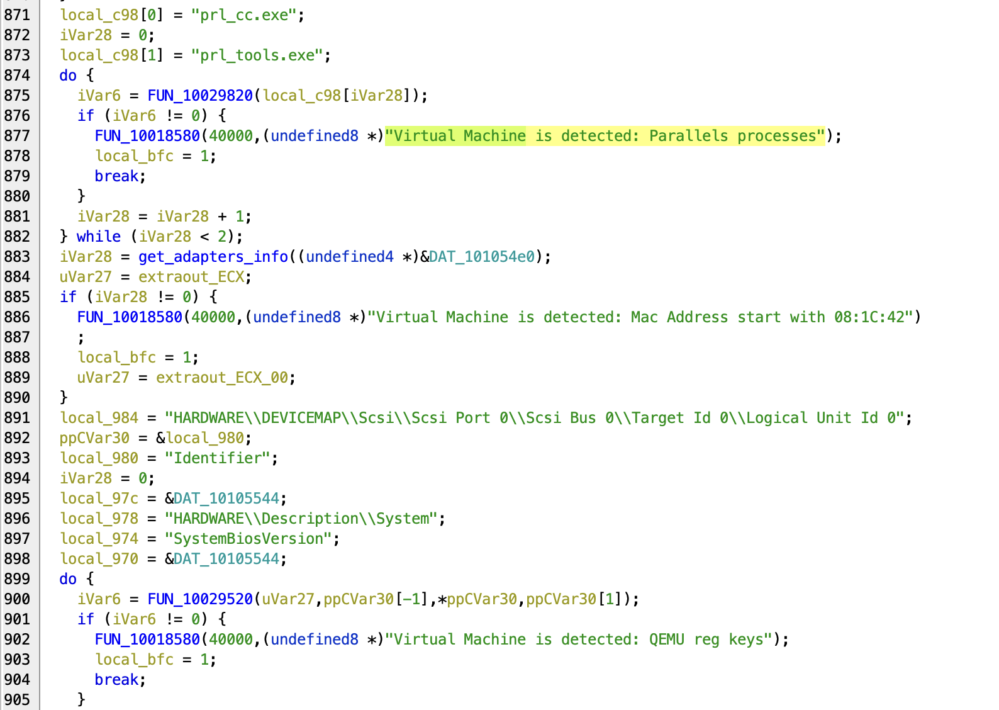
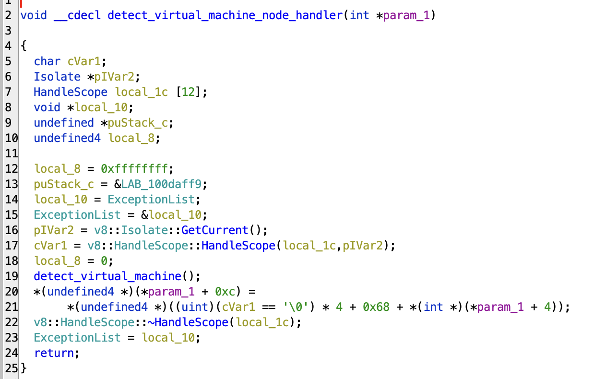

# CVE-2023-33668

## Summary

DigiExam is a ~~surveillance~~ exam and proctoring software. The software is installed in schools' (or students') computers. When the student joins an exam, DigiExam will: ensure it's not running in a Virtual Machine, terminate all applications, fullscreen itself, and prevent the user from going anywhere else than the DigiExam window. 

It has been found that the security detections are weak and can be easily bypassed by simply replacing a file (owned by the user) in the file system. This has been confirmed to work in DigiExam v14.0.2 and not tested again since then (I passed my exam :)).

Vulnerability: DigiExam (an Electron application) "outsources" the virtual machine detection (along with most security features) to a native module called dx-sec. The lack of integrity check on the dx-sec module allows to replace the module by a patched version. The patch can essentially modify any features located within dx-sec, including virtual machine detection (and others, such as the whitelist of illegal processes, etc). 

## Technical details

Upon it's first launch, the DigiExam application will download native modules in `%localappdata%\DigiExam\app-14.0.2\resources\app.asar.unpacked\node_modules\%modulename%\build\Release\%modulename.node%`. These .node files are (as instructed by `file`) `PE32 executable (DLL) (GUI) Intel 80386, for MS Windows`. 

Opening the dx-sec file in Ghidra and searching for the string "Virtual Machine" gives plenty of results and leads to `FUN_10020370` - renamed `detect_virtual_machine` (which gives pretty interesting insights into what is being examined for VM detection).

`detect_virtual_machine` has one xref to `FUN_10007ab0` - renamed `detect_virtual_machine_node_handler` - which appears to be a library's entrypoint for Node stuff (constructor and destructor around our 'main' function `detect_virtual_machine`).

`detect_virtual_machine` can be patched to return immediately. The right side of the screenshot is the patched version.

This will bypass completely the VM detection logic.

## Further

As mentioned in the introduction, DigiExam is often installed in **shared** schools' computers. Instead of patching the VM detection logic, an attacker could leverage this to get code execution on any student's session as soon as they take an exam, allowing more destructive attacks on students' documents and informations. Persistence is until DigiExam gets updated.
